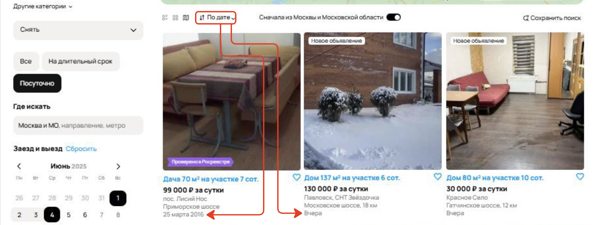
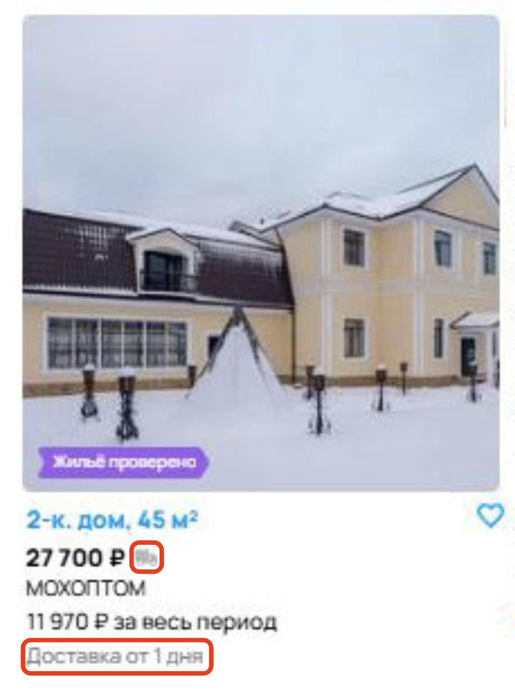
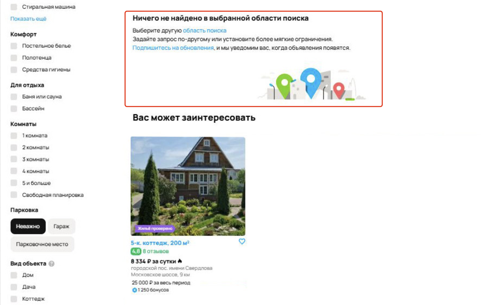

# Баг-репорт АВИТО

| ID                                                                                              | Summary | Severity            | Priority     | Status | Steps to Reproduce                                                                                                                                                                                                                                                                                                                                                 | Expected Result                                                                                                                                                                                  | Actual result                                                                                                                                                                                                                               | Description                                                                                                                                                                                                                           | Attachment | Annotation                                                                                                                                                                                                                                                      |
| ----------------------------------------------------------------------------------------------- | ------- | ------------------- | ------------ | ------ | ------------------------------------------------------------------------------------------------------------------------------------------------------------------------------------------------------------------------------------------------------------------------------------------------------------------------------------------------------------------ | ------------------------------------------------------------------------------------------------------------------------------------------------------------------------------------------------ | ------------------------------------------------------------------------------------------------------------------------------------------------------------------------------------------------------------------------------------------- | ------------------------------------------------------------------------------------------------------------------------------------------------------------------------------------------------------------------------------------- | ---------- | --------------------------------------------------------------------------------------------------------------------------------------------------------------------------------------------------------------------------------------------------------------- |
| 1                                        | Нарушение географической фильтрации в результатах поиска       | S2 - Критический    | P1 - Высокий | Открыт | 1. Открыть сайт и перейти на страницу с объявлениями о посуточной аренде.&#xA;2\. В разделе фильтров выбрать регион "Москва и Московская область".&#xA;3\. Обнаружить, что среди объявлений присутствуют объекты, расположенные в Санкт-Петербурге или Ленинградской области.                                                                                      | При выборе региона "Москва и Московская область" в фильтре, поисковая выдача должна содержать только объявления, географически относящиеся к Москве и МО.                                        | Несмотря на установленный фильтр, в результатах отображаются объявления, расположенные в Санкт-Петербурге и Ленинградской области,.                                                                                                         | Поисковая система не соблюдает установленное ограничение по региону.&#xA;Баг делает невозможным целевой поиск по региону, снижает качество пользовательского опыта и может привести к потере доверия к функциональности платформы.    |       | Был выбран высокий приоритет и критический критичность, баг мешает работе основного функционала.                                                                                                                                                                |
| 2                                  | Некорректная сортировка предложений при выборе опции "По дате"       | S3 - Значительный   | P2 - Средний | Открыт | 1. Открыть сайт и перейти на страницу с объявлениями о посуточной аренде.&#xA;2\. В панели сортировки выбрать опцию "По дате".&#xA;3\. Просмотреть список предложений и обратить внимание на отображаемые даты публикации.                                                                                                                                         | При выборе опции сортировки "По дате" предложения должны отображаться в порядке от самых новых к самым старым.                                                                                   | Предложения отсортированы в нарушенном порядке. В начале списка отображаются устаревшие предложения, такие как "25 марта 2016 года", далее — "Вчера", "7 дней назад", "4 часа назад", что свидетельствует о неправильной логике сортировки. | Функциональность сортировки по дате реализована некорректно, это вводит пользователя в заблуждение и затрудняет поиск актуальных предложений.                                                                                         |       | Был выбран средний приоритет и значительная критичность, баг не мешает работе основного функционала, но вводит в заблуждение юзеров.                                                                                                                            |
| 3                           | Несоответствие количества объявлений в заголовке и фактической выдаче       | S3 - Значительный   | P2 - Средний | Открыт | 1. Открыть сайт и перейти на страницу с объявлениями о посуточной аренде.&#xA;2\. Выбрать "Посуточная аренда", локацию - "Москва и Московская область", в параметрах категории - тип жилья: дома, дачи, коттеджи, таунхаусы.&#xA;3\. Обратить внимание на заголовок страницы.&#xA;4\. Убедиться, что общее количество предложений превышает указанное в заголовке. | Заголовок должен отображать реальное количество предложений, соответствующее числу элементов в результатах выдачи.                                                                               | В заголовке указано "Посуточная аренда домов, дач, коттеджей, таунхаусов в Москве и Московской области — 6", при этом фактически загружено не менее 10 предложений, что превышает указанное количество.                                     | Баг вводит пользователя в заблуждение, снижает доверие к функционалу и может повлиять на восприятие полноты и актуальности информации.                                                                                                |       | Был выбран средний приоритет и значительная критичность, баг не мешает работе основного функционала, но вводит в заблуждение юзеров.                                                                                                                            |
| 4        | На карте отображается Санкт-Петербург при поиске объектов по Москве и Московской области       | S3 - Значительный   | P2 - Средний | Открыт | 1. Открыть сайт и перейти на страницу с объявлениями о посуточной аренде.&#xA;2\. Выбрать в фильтре регион "Москва и Московская область".&#xA;3\. Обратить внимание на отображение объектов на карте.                                                                                                                                                              | При задании поискового запроса, ограниченного Москвой и Московской областью, карта должна отображать только релевантные географические точки.                                                    | На интерактивной карте отображается метка, соответствующая Санкт-Петербургу, несмотря на то, что фильтр местоположения в поиске установлен на Москву и МО.                                                                                  | Данная ошибка может негативно сказаться на точности поиска и вызвать недоверие со стороны пользователей, ожидающих корректной геопривязки предложений.                                                                                |       | Был выбран средний приоритет и значительная критичность, баг не мешает работе основного функционала, но вводит в заблуждение юзеров.                                                                                                                            |
| 5                                        | Несоответствие цен объявлений фильтру в поисковой выдаче       | S3 - Значительный   | P2 - Средний | Открыт | 1. Открыть сайт и перейти на страницу с объявлениями о посуточной аренде.&#xA;2\. В фильтрах поиска указать максимальную цену: до 50 000 ₽.&#xA;3\. Обнаружить, что среди объявлений отображаются объекты с ценами, значительно превышающими 50 000 ₽.                                                                                                             | При установке фильтра "Цена до 50 000 ₽", в поисковой выдаче должны отображаться только те объявления, у которых цена не превышает 50 000 ₽.                                                     | Несмотря на установленное ограничение до 50 000 ₽, в результатах поиска присутствуют объекты с ценами 99 000 ₽, 80 000 ₽, 130 000 ₽, что нарушает логику работы фильтра.                                                                    | Баг приводит к неправильной выдаче и снижает доверие к инструменту фильтрации. Пользователь не может эффективно отфильтровать объекты в пределах своего бюджета.                                                                      |       | Был выбран средний приоритет и значительная критичность, баг не мешает работе основного функционала, но вводит в заблуждение юзеров.                                                                                                                            |
| 6          | Некорректное отображение выбранного способа представления товаров на странице каталога       | S4 - Незначительный | P2 - Средний | Открыт | 1. Открыть сайт и перейти на страницу с объявлениями о посуточной аренде.&#xA;2\. В панели выбора способа отображения выбрать вариант "Сетка".&#xA;3\. Обратить внимание на представление товаров на странице и на активный вариант в панели выбора.                                                                                                               | При выборе способа отображения "Сетка" предложения отображаются в сетке, а соответствующая иконка в панели выбора должна быть выделена.                                                          | Предложения отображаются в формате "Сетка", но панель выбора показывает активным вариант "На Карте".                                                                                                                                        | Ошибка вводит пользователя в заблуждение и может повлиять на взаимодействие с каталогом.                                                                                                                                              |       | В контексте баг-репорта предполагается, что отображение товаров "На карте" исправно работает, некорректно отображается только иконка "Сетка". &#xA;&#xA;Был выбран средний приоритет и незначительная критичность, баг не мешает работе основного функционала.  |
| 7                                                            | Некорректное отображение breadcrumbs       | S4 - Незначительный | P3 - Низкий  | Открыт | 1.Открыть главную страницу сайта.&#xA;2\. Перейти в раздел Недвижимость.&#xA;3\. Выбрать категорию Дома, дачи, коттеджи.&#xA;4\. Выбрать опцию Снять.&#xA;5\. Перейти в подкатегорию Посуточно.&#xA;6\. Обратить внимание на отображение иерархии разделов в верхней части страницы.                                                                               | При нахождении в разделе "Посуточная аренда домов, дач, коттеджей, танхаусов" должна корректно отображаться вложенность:&#xA;Главная > Недвижимость > Дома, дачи, коттеджи > Снять > Посуточно.  | Отображение некорректно: Главная > Недвижимость > Дома, дачи, коттеджи > Снять > На длительный срок. &#xA;Последний уровень вложенности некорректный.                                                                                       | Некорректная иерархия разделов может создавать неудобства для пользователей при навигации по каталогу.                                                                                                                                |        | Был выбран низкий приоритет и незначительная критичность,  баг не мешает работе основного функционала.                                                                                                                                                          |
| 8                 | Отсутствует цена за весь период аренды в некоторых объявлениях поисковой выдачи       | S4 - Незначительный | P3 - Низкий  | Открыт | 1. Открыть сайт и перейти на страницу с объявлениями о посуточной аренде.&#xA;2\. В поисковой форме установить даты аренды.&#xA;3\. Ознакомиться с результатами поиска.&#xA;4\. Обратить внимание на информацию о стоимости в сутки и стоимости за весь период в объявлениях.                                                                                      | В карточке каждого объявления должны отображаться обе стоимости: цена за сутки, цена за весь выбранный период аренды (на основе дат, указанных пользователем).                                   | В первых 6 объявлениях поисковой выдачи отображается только цена за сутки, при этом стоимость за весь период аренды отсутствует, несмотря на установленный диапазон дат.                                                                    | Баг нарушает целостность информации, необходимой пользователю для сравнения предложений и принятия решения. Наличие этой информации критично для арендаторов, поскольку именно общая сумма аренды определяет доступность предложения. |       | Был выбран низкий приоритет и значительная критичность, баг не мешает работе основного функционала, но вводит в заблуждение юзеров.                                                                                                                             |
| 9                             | Отображается опция доставки для объявления о посуточной аренде дома       | S4 - Незначительный | P3 - Низкий  | Открыт | 1. Открыть сайт и перейти на страницу с объявлениями о посуточной аренде.&#xA;2\. Выбрать "Посуточная аренда", в параметрах категории - тип жилья: дома, дачи, коттеджи, таунхаусы.&#xA;3\. Найти объявление, в карточке которого отображается опция «Доставка от 1 дня».                                                                                          | В карточках объявлений, относящихся к услугам аренды недвижимости, не должна отображаться опция «Доставка от 1 дня», так как она не применима к данному типу объектов.                           | В одном из объявлений на посуточную аренду дома есть подпись «Доставка от 1 дня», что не соответствует логике и сути предоставляемой услуги.                                                                                                | Баг может негативно повлиять на восприятие ресурса как надёжной и логичной платформы.                                                                                                                                                 |       | Был выбран низкий приоритет и незначительная критичность,  баг не мешает работе основного функционала.                                                                                                                                                          |
| 10 | Блок "Ничего не найдено в выбранной области поиска" отображается при наличии результатов выдачи      | S4 - Незначительный | P3 - Низкий  | Открыт | 1. Открыть сайт и перейти на страницу с объявлениями о посуточной аренде.&#xA;2\. Ввести в поисковую строку запрос, по которому гарантировано есть результаты.&#xA;3\. Обратить внимание на наличие блока «Ничего не найдено в выбранной области поиска».                                                                                                          | Если по заданным параметрам поиска найдены объявления, блок с сообщением "Ничего не найдено в выбранной области поиска" не должен отображаться.                                                  | При наличии как минимум четырёх страниц объявлений по заданному запросу, в интерфейсе отображается сообщение "Ничего не найдено в выбранной области поиска", что противоречит фактическому содержимому страницы.                            | Баг дезориентирует пользователя, создавая ощущение, что поиск не дал результатов, несмотря на фактическую выдачу. Это снижает доверие к системе и нарушает пользовательский опыт.                                                     |       | Был выбран низкий приоритет и незначительная критичность,  баг не мешает работе основного функционала.                                                                                                                                                          |
| 11                                    | Опечатка в кнопке поиска: вместо "Найти" отображается "Найт"      | S5 - Тривиальный    | P3 - Низкий  | Открыт | 1. Открыть сайт и перейти на страницу с объявлениями о посуточной аренде.&#xA;2\. Обратить внимание на кнопку, расположенную рядом с полем ввода поискового запроса.&#xA;3\. Проверить надпись на кнопке.                                                                                                                                                          | На кнопке поисковой строки должно быть  слово "Найти".                                                                                                                                           | На кнопке отображается опечатка — "Найт".                                                                                                                                                                                                   | Баг может влияет на восприятие интерфейса и снижает общий уровень профессионализма продукта.                                                                                                                                          |       | Был выбран низкий приоритет и тривиальную критичность,  баг не мешает работе основного функционала.                                                                                                                                                             |
| 12                             | Опечатка в фильтре "Площадь участка": вместо "До" отображается "Дв"      | S5 - Тривиальный    | P3 - Низкий  | Открыт | 1. Открыть сайт и перейти на страницу с объявлениями о посуточной аренде.&#xA;2\. Обратить внимание на параметр фильтра "Площадь участка".&#xA;3\. Проверить надпись в поле ввода.                                                                                                                                                                                 | В параметрах фильтра "Площадь участка" должны использоваться корректные обозначения пределов: "От" и "До".                                                                                       | Во втором поле фильтра вместо "До" отображается опечатка — "Дв".                                                                                                                                                                            | Баг может влияет на восприятие интерфейса и снижает общий уровень профессионализма продукта.                                                                                                                                          |       | Был выбран низкий приоритет и тривиальную критичность,  баг не мешает работе основного функционала.                                                                                                                                                             |
